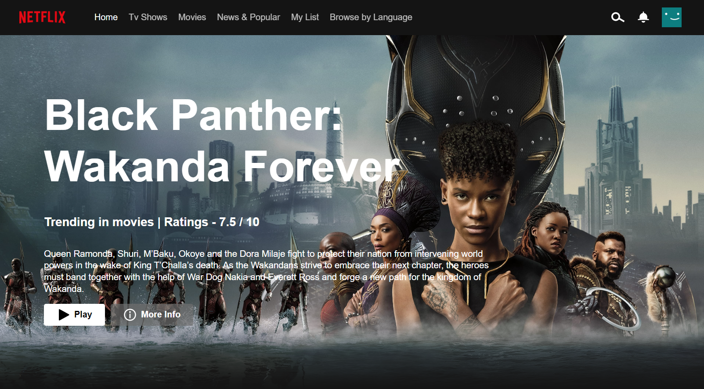

# Netflix-Clone

**Netflix clone** with **Landing page** and **Netflix Web App** created using _HTML_, _CSS_, _Javascript_ and _API_

As a frontend developer, I built a Netflix UI clone featuring a landing page and a web app using HTML, CSS, JavaScript, and an API.  

I utilized **advanced JavaScript** concepts such as **Promises** and **Fetch** to connect to the **API** and _retrieve movie data with categories for the web app._

The project allowed me to showcase my skills in web design and frontend development, as I was able to replicate the look and feel of the Netflix interface. 

I created a responsive user experience by _dynamically retrieving and displaying data from the API_.

## Netflix Web App

[Click here to view the project](https://netflix-web-clone-abhi.netlify.app/)

> ## Key Points
>
> - Every time the web app is refreshed, a new movie poster appears in the background section.
> - The poster includes the movie's name, ratings, and a brief intro about it.
> - This feature adds a visually appealing and interactive element to the user experience.
> - It also showcases the ability to retrieve and display dynamic data from an API using advanced JavaScript.
> - The feature can be implemented using a combination of HTML, CSS, and JavaScript to create the layout and design, and to retrieve and display the data from the API.
> - It demonstrates the ability to create a responsive and dynamic web application that changes with user actions.

## Netflix Landing Page

[Click here to view the project](https://lnkd.in/dCjjWunB)

> ## Key Points
>
> - The landing page is a replica of the official Netflix landing page.
> - It was built using HTML, CSS, and JavaScript to create the layout and design.
> - The goal was to replicate the look and feel of the official landing page as closely as possible.
> - This project allowed me to practice my web design and frontend development skills, including layout design, typography, and color schemes.
> - It also demonstrates the ability to replicate a popular interface and create a visually appealing user experience.

  

 

> # Some key takeaways from this project include:
>
> - Working with APIs to retrieve and display dynamic data in a web application.
> - Utilizing JavaScript Promises and Fetch to handle API requests and responses.
> - Practicing web design and frontend development skills to create a visually appealing and functional platform.
> - Demonstrating the ability to replicate a popular interface and create a user-friendly experience.
